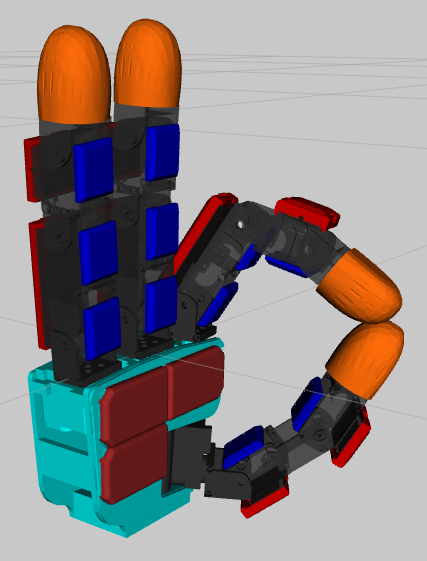

# ROS URDF for XELA Sensors

> NOTE: There is currently no module to broadcast sensor readings to the model. If there is a need, please make note of the joint names and make own joint_publisher node and enable taxel visualization 
> NOTE: As each hand is different, some elements in URDF files need to be changed manually 
> NOTE: Gravity compensation must be calibrated after adding sensors. It will be the responsibility of the user

## Installation
Unpack the xela_models directory into your catkin workspace src directory and set it up to be used like any other package for ROS

## Use
To use sensors with your URDF files, import XELA xacro file by adding <xacro:include filename="$(find xela_models)/urdf/xela.xacro" /> to your xacro URDF file.

## Visualization (XACRO)
To run the visualization of the model, use following command;
>roslaunch xela_models display.launch model:=&lt;model&gt;

### Available models:
| sensor_model | Description |
| --- | --- |
| 4x4 | default 4x4 sensor (XR1844, XR1944) |
| 1x6 | specific sensor layout of 3xXR1921 |
| 4x6 | default 4x6 sensor |
| aftc | curved fingertip sensor (for Allegro hand) |
| aftf | flat fingertip sensor (for Allegro hand) |
| allegro_hand_right | Allegro hand full assembly (right) |

> You may also take a look in the specific files in xela_models/urdf 
__Do not edit the xela.xacro file.__

## Visualization (URDF)
To run the visualization of the model, use following command;
>roslaunch xela_models urdf.launch model:=&lt;model&gt;

### Available models:
| sensor_model | Description |
| --- | --- |
| ahrcpcpn | Allegro hand full assembly (right) with curved fingertips, phalange sensors (covers on back), palm sensors and no visual taxels |

## Available default sensors (XACRO):
| Model | Linking tag |
| --- | --- |
| XR1944 | <xacro:sensor4x4 sequence="1" parent="base_link" /> |
| XR1946 | <xacro:sensor4x6 sequence="1" parent="base_link" /> |

## Required arguments you will need to specify (XACRO):
| Argument | Description | Example |
| --- | --- | --- |
| sequence | Unique name for the sensor | sequence=”1” |
| parent | Parent link the sensor should be attached to | parent=”base_link” |

## Optional arguments you can edit (XACRO):
| Argument | Description | Example |
| --- | --- | --- |
| x | To set base position on x axis | x=”0.01” | 
| rx | To set rotation over x axis (in degrees) | rx=”90” | 
| y | To set base position on y axis | y=”0.01” | 
| ry | To set rotation over y axis (in degrees) | ry=”90” | 
| z | To set base position on z axis | z=”0.01” | 
| rz | To set rotation over z axis (in degrees) | rz=”90” | 
| col | To set one of the default colors: _black_, _blue_, _green_, _grey_, _orange_, _brown_, _red_, _white_ | col=”blue” | 
| body | To include or exclude the shell of the sensor (set to 0 if your mesh already has sensor shape) | body=”0” __Note__: by default body=”1” | 
| taxels | To show or hide taxels | taxels=”0” __Note__: single sensors by default will have taxels on, whilst Allegro hands will have them off | 

## Available special sensors (XACRO):
| Model | Linking tag | arguments |
| --- | --- | --- |
| Allegro hand (right) full assembly | <xacro:allegro_hand_right sequence="1" parent="base_link" /> | Same as regular sensors, except no _col_ Plus _covers_, _palm_, _tips_, _phalanges_ |
| 3xXR1921 | <xacro:sensor1x6 sequence="1" parent="base_link" /> | Same as regular sensors |

## Special arguments (XACRO):
| Argument | Description | Example |
| --- | --- | --- |
| covers | To enable or disable controller covers | covers=”0” __Default__: covers=”1” |
| palm | To enable or disable sensors on the palm | palm=”0” Default: palm=”1” |
| phalanges | To enable or disable phalange sensors | phalanges=”0” __Default__: phalanges=”1” |
| tips | To set the type of fingertips _curved_, _flat_, _default_ __Note__: default means Allegro Hand’s own tips You can also set to none to have no tips | tips=”curved” __Default__: tips=”flat” __Note__: set to _default_ if you wish the original tips without sensors |
| defaultnames | To enforce using default link and joint names | defaultnames=1 __Default__: defaultnames=0 |
| baseispalm | enforce naming of the hand's __base_link__ to be called __palm_link__ _(allegro default)_ | baseispalm=1 __Default__: baseispalm=0 |

## Changelog and notes
### _2021/10/14_
* Change links to official ones for v4 without sensors and use sensor bodies as fixed link
* Modify some initial values to match the hand for testing
* Add ahrcpcpn.urdf with new details (Allegro Hand Right with Curved Fingertips, Phalange sensors, Phalange covers and Palm sensors)
#### Known issues
- Encoders can report slightly different data between hands
- Accuracy of the Allegro hand -> TF is separate from URDF and would need to be manipulated by separately (not supported by XELA)

### _2021/10/12_
* Add _baseispalm_ parameter to enforce default name for allegro ROS node
* Update link names to be fully compatible with allegro's

### _2021/10/04_
* Add more options for custom use cases
    * Inertias can be disabled for individual sensors if calculated into parent link
    * Hand links can be with default names by using _defaultnames_ parameter
* All links that move and sensors have defined inertias and masses for simulation (calculated with trimesh library for Python)

### _2021/09/13_ 
* Replace the link between base and finger
* Move finger up by 4 mm due to the change in the link
* Edit sensors to have an option to turn on/off taxel positions
    * Allegro Hand will have by default taxels turned off
    * Regular sensors will have by default taxels turned on
* Add new parameter "taxels" for sensors and hands/grippers

## To Do
- [ ] Add XR1911
- [ ] Add XR1921
- [ ] Add XR1922
- [ ] Add Robotiq Gripper
- [ ] Add Schunk Gripper
- [ ] Add SAKE Gripper
- [ ] Add Allegro Hand - Left
- [ ] Add pure URDF files of configurations

## Contributors
| Photo | Contributor | Relation |
|:---:|:---:|:---:|
|  | [@mcsix](https://github.com/mcsix) | XELA Software Engineer |