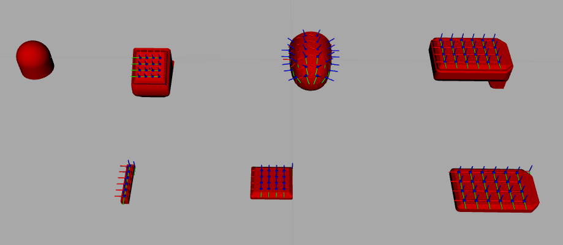
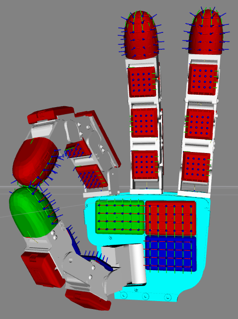
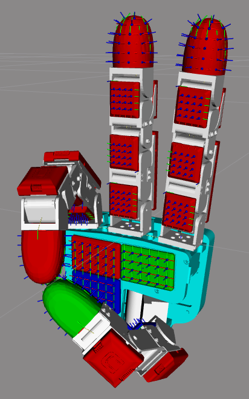

# ROS URDF for XELA Sensors

> NOTE: There is currently no module to broadcast sensor readings to the model. If there is a need, please make note of the joint names and make your own joint_publisher node and enable taxel visualization<br>
> NOTE: As each hand is different, some elements in URDF files need to be changed manually<br>
> NOTE: Gravity compensation must be calibrated after adding sensors. It will be the responsibility of the user

## Installation
Unpack the xela_models directory into your colcon workspace src directory and set it up to be used like any other package for ROS 2, then build
```
cd ~/work_space
colcon build
```

## Use
To use sensors with your URDF files, import XELA xacro file by adding <xacro:include filename="$(find xela_models)/urdf/xela.xacro" /> to your xacro URDF file.

## Visualization (XACRO)
To run the visualization of the model, use following command;
>ros2 launch xela_models xacro_launch.py xela_sensor:=&lt;sensor_model&gt;
 
### Available Sensor models:
| sensor_model                   | Description                                      |
|--------------------------------|--------------------------------------------------|
| all_parts_of_individual_module | uSPa 61   / 6 x 1 taxels  |
|                                | uSPa 44   / 4x4 taxels    |
|                                | uSPa 46   / 4x6 taxels    | 
|                                | uSPr 2F   / 4x6 taxels in the fingertip |
|                                | uSCu ALHA / 30 taxels in the Curved fingertip |
| allegro_hand_left_curved       | Allegro hand v4, full assembly, curved tips (left)  |
| allegro_hand_right_curved      | Allegro hand v4, full assembly, curved tips (right) |

### 1. Launch all_parts_of_individual_module view 
```
source install/setup.bash
ros2 launch xela_models xacro_launch.py xela_sensor:=all_parts_of_individual_module
```


### 2. Launch left allegrohand view 
```
source install/setup.bash
ros2 launch xela_models xacro_launch.py xela_sensor:=allegro_hand_left_curved
```


### 3. Launch right allegrohand view
```
source install/setup.bash
ros2 launch xela_models xacro_launch.py xela_sensor:=allegro_hand_right_curved
```



> You may also take a look in the specific files in xela_models/urdf<br>
__Do not edit the xela.xacro file.__

## Available default sensors (XACRO):
| Model    | Linking tag                                         |
|----------|-----------------------------------------------------|
| uSPa61   | <xacro:sensor1x6n 	sequence="1" col="red" parent="base_link" taxels="1" x="0.1" y="0.1" /> |
| uSPa44   | <xacro:sensor4x4n 	sequence="2" col="red" parent="base_link" taxels="1" x="0.0" y="0.1" /> |
| uSPa46   | <xacro:sensor4x6n	sequence="3" col="red" parent="base_link" taxels="1" x="-0.15" y="0.1" /> |
| uSPr2F   | <xacro:uspref2  	sequence="4" col="red" parent="base_link" taxels="1" x="-0.15" y="0.015" /> |
| uSCu ALHA| <xacro:sensoraftcn sequence="5" col="red" parent="base_link" taxels="1" x="0.0" y="0.0" />  |

### Required arguments you will need to specify (XACRO):
| Argument | Description                                  | Example            |
|----------|----------------------------------------------|--------------------|
| sequence | Unique name for the sensor                   | sequence="1"       |
| parent   | Parent link the sensor should be attached to | parent="base_link" |
--------------------------------------------------------------------------------

### Optional arguments you can edit (XACRO):
| Argument | Description                                                                                              | Example                                                                                                        |
|----------|----------------------------------------------------------------------------------------------------------|----------------------------------------------------------------------------------------------------------------|
| x        | To set base position on x axis                                                                           | x="0.01"”"                                                                                                       | 
| rx       | To set rotation over x axis (in degrees)                                                                 | rx="90"                                                                                                        | 
| y        | To set base position on y axis                                                                           | y="0.01"                                                                                                       | 
| ry       | To set rotation over y axis (in degrees)                                                                 | ry="90"                                                                                                        | 
| z        | To set base position on z axis                                                                           | z="0.01"                                                                                                       | 
| rz       | To set rotation over z axis (in degrees)                                                                 | rz="90"                                                                                                        | 
| col      | To set one of the default colors:<br>_black_, _blue_, _green_, _grey_, _orange_, _brown_, _red_, _white_ | col="blue"                                                                                                     | 
| body     | To include or exclude the shell of the sensor<br>(set to 0 if your mesh already has sensor shape)        | body="0"<br>__Note__: by default body="1"                                                                      | 
| taxels   | To show or hide taxels                                                                                   | taxels="0"<br>__Note__: Taxel is turned on by default for single sensors, but can be turned off for Allegro hands. ex) to prevent excessive computation during motion planning for a sensor-equipped robot, tactile information can be disabled and used to generate URDFs | 
| sensor_collision   | To set collision info on taxel                                                                 | sensor_collision="0"<br>__Note__: Collision information for sensors is disabled by default. It can be enabled if necessary | 


## Available Integrated model (XACRO):

| Model    | Linking tag                                         | arguments                                                                              |
|----------|-----------------------------------------------------|----------------------------------------------------------------------------------------|
| Allegro Hand v4 Curved, left    | <xacro:allegro_hand_left_new sequence="0" tips="curved" parent="world" defaultnames="1" palm="1" taxels="1" sensor_collision="0" /> | Same as regular sensors, except no _col_<br>Plus _covers_, _palm_, _tips_, _phalanges_ |
| Allegro Hand v4, Curved, right | <xacro:allegro_hand_right_new sequence="0" tips="curved" parent="world" defaultnames="1" palm="1" taxels="1" sensor_collision="0" /> | |


### Optional Arguments (XACRO):
| Argument     | Description                                                                                                                                                 | Example                                                                                                               |
|--------------|-------------------------------------------------------------------------------------------------------------------------------------------------------------|-----------------------------------------------------------------------------------------------------------------------|
| covers       | To enable or disable controller covers                                                                                                                      | covers=”0”<br>__Default__: covers=”1”                                                                                 |
| palm         | To enable or disable sensors on the palm                                                                                                                    | palm=”0”<br>Default: palm=”1”                                                                                         |
| phalanges    | To enable or disable phalange sensors                                                                                                                       | phalanges=”0”<br>__Default__: phalanges=”1”                                                                           |
| tips         | To set the type of fingertips<br>_curved_, _flat_, _default_<br>__Note__: default means Allegro Hand’s own tips<br>You can also set to none to have no tips | tips=”curved”<br>__Default__: tips=”flat”<br>__Note__: set to _default_ if you wish the original tips without sensors |
| defaultnames | To enforce using default link and joint names                                                                                                               | defaultnames=1<br>__Default__: defaultnames=0                                                                         |
| baseispalm   | enforce naming of the hand's __base_link__ to be called __palm_link__ _(allegro default)_                                                                   | baseispalm=1<br>__Default__: baseispalm=0                                                                             |


## Changelog and notes
### _2025/11/26_
* Version for ROS 2 (Tested on Humble)
* Sensor link simplification:
  - Reduced from 3 links per sensor to 1 link
  - Reduced from 3 joints per sensor to 1 joint
* Updated palm sensor module and sensor base models and meshes
* Added left allegrohand model
* Added uSPr2F Fingertip model

### _2021/10/14_
* Change links to official ones for v4 without sensors and use sensor bodies as fixed link
* Modify some initial values to match the hand for testing
* Add ahrcpcpn.urdf with new details (Allegro Hand Right with Curved Fingertips, Phalange sensors, Phalange covers and Palm sensors)
#### Known issues
- Encoders can report slightly different data between hands
- Accuracy of the Allegro hand -> TF is separate from URDF and would need to be manipulated by separately (not supported by XELA)

### _2021/10/12_
* Add _baseispalm_ parameter to enforce default name for allegro ROS node
* Update link names to be fully compatible with allegro's

### _2021/10/04_
* Add more options for custom use cases
    * Inertias can be disabled for individual sensors if calculated into parent link
    * Hand links can be with default names by using _defaultnames_ parameter
* All links that move and sensors have defined inertias and masses for simulation (calculated with trimesh library for Python)

### _2021/09/13_ 
* Replace the link between base and finger
* Move finger up by 4 mm due to the change in the link
* Edit sensors to be able to turn on/off taxel positions
    * Allegro Hand will have by default taxels turned off
    * Regular sensors will have by default taxels turned on
* Add new parameter "taxels" for sensors and hands/grippers

## To Do
- [ ] Add XR1911
- [ ] Add XR1921
- [ ] Add XR1922
- [ ] Add Robotiq 2F Gripper
- [ ] Add Robotiq Hand-# Gripper
- [ ] Add Schunk Gripper
- [ ] Add SAKE Gripper

## Contributors
|                                           Photo                                           |                 Contributor                  |        Relation        |
|:-----------------------------------------------------------------------------------------:|:--------------------------------------------:|:----------------------:|
|      [](https://github.com/mcsix)      |      [@mcsix](https://github.com/mcsix)      | XELA Software Engineer |
| [](https://github.com/invokelshn) | [@invokelshn](https://github.com/invokelshn) | XELA Software Engineer |